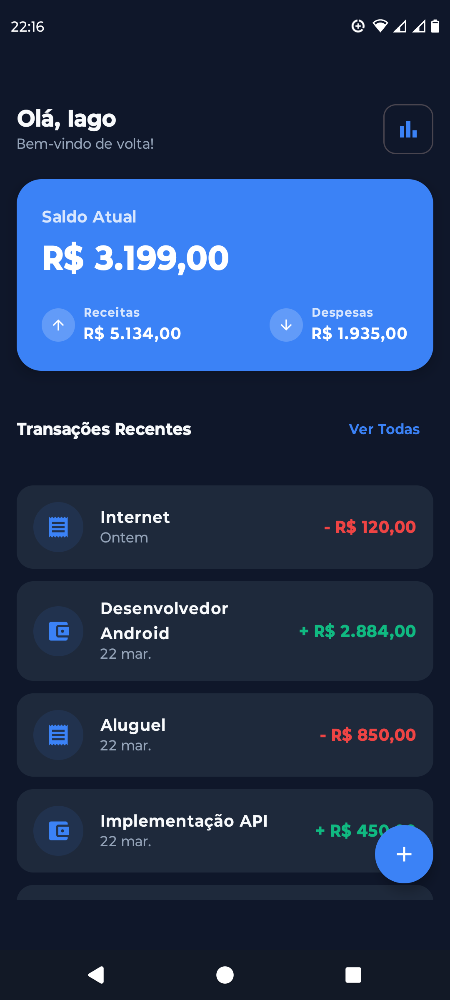
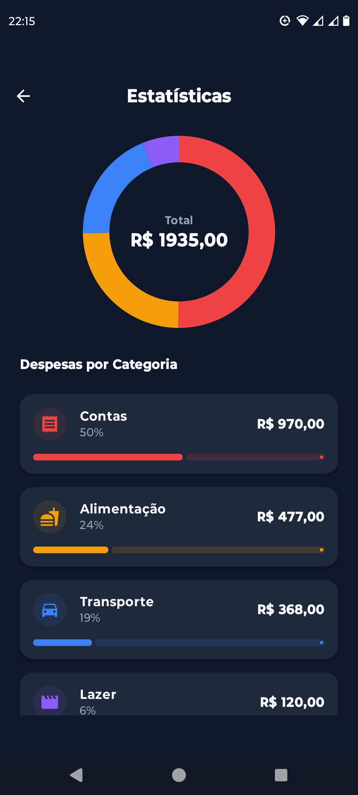
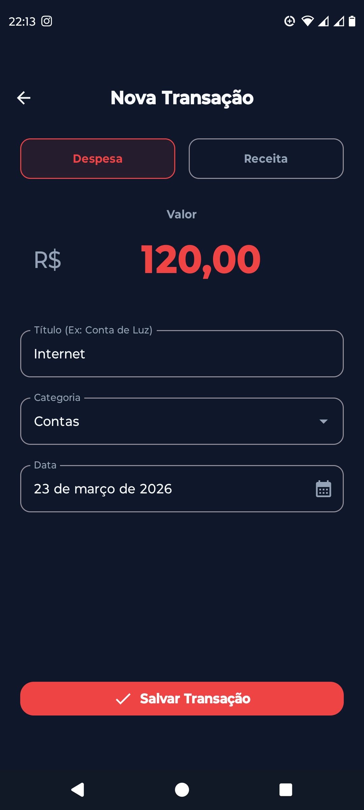

# ExpenseApp - Modern Android Finance Tracker
🇺🇸 [English](#-english) | 🇧🇷/🇵🇹 [Português](#-português)

---

## 🇺🇸 English


**ExpenseApp** is a native Android application focused on personal finance control. Developed with **Modern Android Development (MAD)** best practices, the project demonstrates advanced use of Jetpack Compose, Clean Architecture, and reactivity with Kotlin Flows.

> **Project Goal:** Demonstrate mastery in native Android development focused on scalability, testability, and separation of concerns, aiming for Mid-Level (Pleno) positions.

### 📱 Screenshots & Demo

<div align="center">
  
  
  
  
</div>

### ✨ Key Features (Highlights)

More than just a finance tracker, this project focuses on technical excellence and User Experience (UX):

- **Offline-First Synchronization (Room + Firebase):** Data is first saved locally in Room and then synchronized with **Cloud Firestore**. This ensures the app works perfectly offline and keeps data safe in the cloud.
- **Optimized Performance (Metadata Summary):** Instead of calculating totals from thousands of transactions on every Home load, the app maintains a **User Summary** (Metadata) document. This optimizes read costs and UI performance.
- **Secure Authentication:** Integrated with **Firebase Auth**, supporting Email/Password and Google Sign-In.
- **Custom Canvas Graphics:** A high-performance **Donut Chart** built from scratch using the Compose Canvas API (`drawArc`), avoiding heavy third-party libraries and demonstrating mathematical logic in UI.
- **Reactive Single Source of Truth:** The UI observes a `Flow` from the Room Database. Any change in the data layer is instantly reflected across all screens.
- **Clean Architecture:** Strict separation into **Domain**, **Data**, and **Presentation** layers. The business logic is pure Kotlin, independent of the Android framework.

### 🛠️ Tech Stack & Architecture

- **UI:** Jetpack Compose, Material Design 3, Compose Navigation.
- **Architecture:** MVVM (Model-View-ViewModel), Clean Architecture, UDF (Unidirectional Data Flow).
- **Dependency Injection:** Dagger Hilt.
- **Local Storage:** Room Database.
- **Cloud/Backend:** Firebase Authentication, Cloud Firestore (NoSQL).
- **Concurrency & Reactive:** Kotlin Coroutines & StateFlow/Flow.
- **Testing:** MockK, Robolectric, JUnit 4, Coroutines Test.

### ⚙️ How to run the project

1. Clone the repository:
   ```bash
   git clone https://github.com/IagoRochaDev/ExpenseApp-Android
   ```
2. Open the project in Android Studio (Iguana or newer recommended).
3. Wait for Gradle to sync dependencies.
4. Run the app on an Emulator or Physical Device.

### 🚀 Roadmap (Next Steps)

- [x] **Firebase Integration:** Auth and Firestore synchronization.
- [x] **User Summary:** Optimized metadata for home dashboard.
- [x] **Unit Testing:** Robust suite for DAOs and Repositories using MockK and Robolectric.
- [x] **CI/CD:** GitHub Actions configured for automated builds and testing.
- [ ] **Data Export:** Add functionality to export transactions to CSV/PDF.
- [ ] **Unit Testing (UI):** Add Jetpack Compose UI tests.

---

## 🇧🇷/🇵🇹 Português

O **ExpenseApp** é um aplicativo Android nativo focado em controle de finanças pessoais. Desenvolvido com as melhores práticas de **Modern Android Development (MAD)**, o projeto demonstra o uso avançado de Jetpack Compose, Arquitetura Limpa (Clean Architecture) e reatividade com Kotlin Flows.

### ✨ Funcionalidades Principais (Highlights)

Mais do que um simples rastreador de despesas, este projeto foca em excelência técnica e Experiência do Usuário (UX):

- **Sincronização Offline-First (Room + Firebase):** Os dados são salvos localmente no Room e sincronizados com o **Cloud Firestore**. Isso garante que o app funcione offline e mantenha os dados seguros na nuvem.
- **Performance Otimizada (User Summary):** Utiliza um documento de metadados para armazenar o saldo total, receitas e despesas. Isso evita a leitura e processamento de todas as transações a cada abertura da Home, reduzindo custos de leitura e melhorando a performance.
- **Autenticação Segura:** Integração com **Firebase Auth**, permitindo login via E-mail/Senha e Google Sign-In.
- **Gráficos Customizados (Canvas):** Um **Donut Chart** de alto desempenho construído do zero usando a API de Canvas do Compose (`drawArc`), demonstrando lógica matemática na UI.
- **Fonte de Dados Reativa:** A interface observa um `Flow` do banco de dados Room. Qualquer alteração na camada de dados é refletida instantaneamente em todas as telas.
- **Arquitetura Limpa:** Separação rigorosa entre as camadas de **Domínio**, **Dados** e **Apresentação**. A lógica de negócio é Kotlin puro, facilitando a testabilidade.

### 🛠️ Stack Tecnológico e Arquitetura

- **UI:** Jetpack Compose, Material Design 3, Compose Navigation.
- **Arquitetura:** MVVM, Clean Architecture, UDF (Fluxo Unidirecional de Dados).
- **Injeção de Dependência:** Dagger Hilt.
- **Armazenamento Local:** Room Database.
- **Cloud/Backend:** Firebase Authentication, Cloud Firestore (NoSQL).
- **Assincronismo & Reatividade:** Kotlin Coroutines & Flow.
- **Testes:** MockK, Robolectric, JUnit 4, Coroutines Test.

### ⚙️ Como executar o projeto

1. Faça o clone do repositório.
```bash
   git clone https://github.com/IagoRochaDev/ExpenseApp-Android
   ```
2. Abra no Android Studio.
3. Espere o Gradle para sincronizar as dependências.
4. Execute o app em um Emulator ou Aparelho Físico.

### 🚀 Próximos Passos (Roadmap)

- [x] **Integração Firebase:** Autenticação e sincronização com Firestore.
- [x] **Metadados (Summary):** Resumo de usuário otimizado para o dashboard.
- [x] **Testes Unitários:** Suíte robusta para DAOs e Repositories usando MockK e Robolectric.
- [x] **CI/CD:** Configurado GitHub Actions para automação de testes e builds.
- [ ] **Exportação de Dados:** Adicionar funcionalidade para exportar transações para CSV/PDF.
- [ ] **Testes de UI:** Adicionar testes de interface com Jetpack Compose Testing.

---

## 🧑‍💻 Author / Autor
**Developed by / Desenvolvido por Iago Rocha Oliveira**

- **LinkedIn:** [iagorochadev](https://www.linkedin.com/in/iagorochadev/)
- **Portfolio:** [IagoRochaDev](https://github.com/IagoRochaDev/)
- **Email:** iagor.oliveira00@gmail.com
